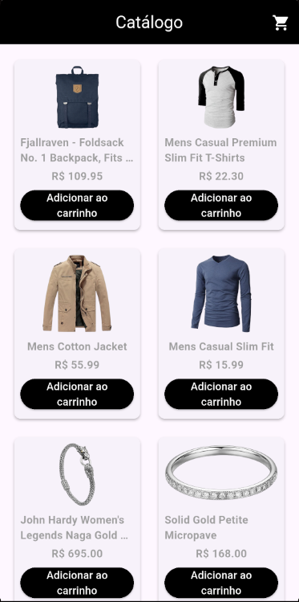
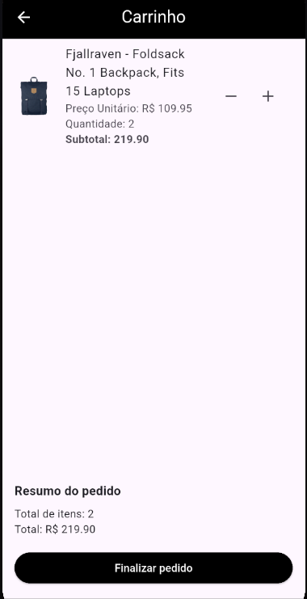
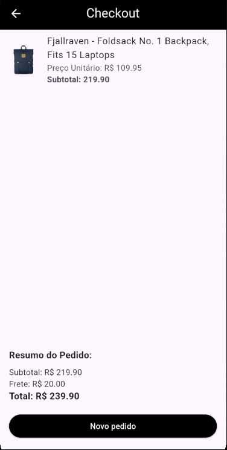

# Flutter Shopping Cart MVVM

Aplicativo Flutter desenvolvido com o padrão **MVVM (Model–View–ViewModel)**, simulando um fluxo completo de **lista de produtos**, **carrinho de compras** e **checkout**.  
O projeto demonstra boas práticas de arquitetura, uso do **Provider** juntamente do **ChangeNotifier** para gerenciamento de estado e aplicação do **padrão Result** para tratar sucesso e falhas nas operações assíncronas, requests usando o **HTTP**.

---

## Funcionalidades

- **Listagem de produtos** com nome, imagem e preço.  
- **Carrinho** com adição, remoção e cálculo automático de total.  
- **Checkout** com integração via `CheckoutApi`.  
- **Tratamento de erros** com o padrão `Result`.  
- **Arquitetura MVVM** (Model, ViewModel, View).  
- **Design responsivo** e paleta de cores personalizada.

---

## Arquitetura do projeto

O app segue o padrão **MVVM**:

| Camada | Descrição | Exemplos |
|---------|------------|-----------|
| **Model** | Representa os dados e suas regras de negócio. | `product.dart`, `cart.dart`, `cart_item.dart` |
| **ViewModel** | Contém a lógica e estado observável da aplicação. | `cart_view_model.dart`, `products_view_model.dart` |
| **View** | Interface do usuário construída em Flutter. | `catalog_view.dart`, `cart_view.dart`, `checkout_view.dart` |
| **Service** | Responsável por comunicação e requisições simuladas. | `products_api.dart`, `checkout_api.dart`, `cart_api.dart` |
| **Utils** | Utilitários e padrões de resposta. | `result.dart` |
| **Widgets** | Componentes reutilizáveis da UI. | `product_card.dart` |

---

## Estrutura de diretórios
```text
lib/
├─ src/
│ ├─ colors/
│ │ └─ cores.dart
│ ├─ models/
│ │ ├─ cart_item.dart
│ │ ├─ cart.dart
│ │ └─ product.dart
│ ├─ services/
│ │ ├─ cart_api.dart
│ │ ├─ checkout_api.dart
│ │ └─ products_api.dart
│ ├─ utils/
│ │ └─ result.dart
│ ├─ view_models/
│ │ ├─ cart_view_model.dart
│ │ └─ products_view_model.dart
│ ├─ views/
│ │ ├─ cart_view.dart
│ │ ├─ catalog_view.dart
│ │ └─ checkout_view.dart
│ └─ widgets/
│ └─ product_card.dart
├─ app.dart
└─ main.dart
```

## Requisitos

| Ferramenta | Versão mínima recomendada |
|-------------|----------------------------|
| **Flutter** | 3.19.0 ou superior |
| **Dart** | 3.3.0 ou superior |
| **Provider** | ^6.1.2 |
| **http** | ^1.5.0
---

## Como executar o projeto

### Clonar o repositório
```bash
git clone https://github.com/viniciusbornhofen/flutter-shopping-cart-mvvm.git
cd flutter-shopping-cart-mvvm
```
### Instale as dependências:
```bash
flutter pub get
```
### Execute o projeto:
```bash
flutter run
```

## Organização dos Commits

Os commits foram estruturados por **funcionalidades principais**, seguindo o padrão de granularidade adequada — ou seja, cada commit representa uma feature significativa (como produtos, carrinho e checkout).  
Alterações pequenas, como ajustes visuais ou correções pontuais, foram feitas separadamente.

### Commits Principais

- **first commit** — Estrutura inicial do projeto.  
- **feat: estruturação básica do app** — Criação da base do aplicativo e configuração inicial.  
- **feat: catálogo já carrega produtos de forma básica** — Implementação inicial da listagem de produtos.  
- **feat: alteração no layout do catálogo** — Atualização visual da tela de catálogo.  
- **feat: layout da tela catálogo atualizado, criação de carrinho e lógica do botão de adicionar ao carrinho** — Implementação da lógica do carrinho e interação com produtos.  
- **feat: delays e simulações de erro e tela de carrinho atualizada** — Adição de delays para testes e atualização da interface do carrinho.  
- **feat: tela de checkout** — Criação da tela de checkout com lógica de finalização de pedido.  
- **feat: uso de padrão Result** — Implementação do padrão `Result` para lidar com sucesso e erro de forma mais segura.  
- **style: mudança nas cores e adição de loading ao clicar em finalizar pedido** — Ajustes de estilo e experiência do usuário.  
- **refactor: remoção de comentários e pequenas melhorias** — Refatoração leve e limpeza do código.

---

## Screenshots e video





[Clique aqui para assistir à demonstração](https://github.com/VinioVnz/flutter-shopping-cart-mvvm/raw/master/assets/videos/simulation.mp4)

## Autor - Vinícius Bornhofen
Desenvolvedor Mobile | Flutter & Dart
[GitHub](https://github.com/VinioVnz)
[LinkedIn](https://www.linkedin.com/in/vinícius-bornhofen-896974333)
